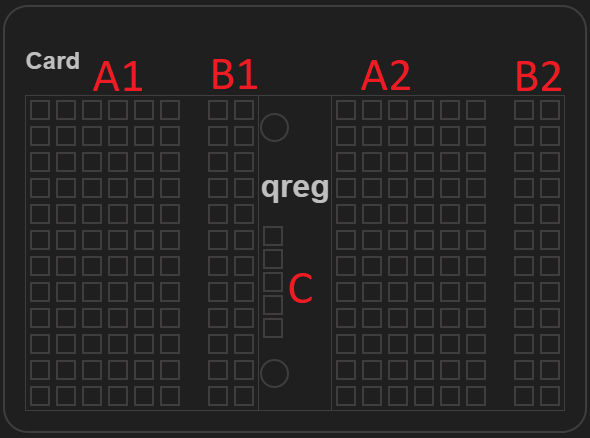
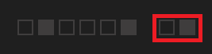

# qreg-calculator
Repository for the qreg calculator. Implemented as HTML Page with some javascript.

The calculator can be run by downloading this git repository and opening the *index.html* with your preferred browser. The latest version of the calculator will also be available through this [link](https://ambitious-dune-01f9db703.azurestaticapps.net/).

The qreg calculator will use three qreg cards to "store" the bit values of 12 or 24 [bip-0039](https://github.com/bitcoin/bips/blob/master/bip-0039/) words using the RAID5 "algorithm" for three data sinks [Raid 5 in the german Wikipedia](https://de.wikipedia.org/wiki/RAID#RAID_5:_Leistung_+_Parit%C3%A4t,_Block-Level_Striping_mit_verteilter_Parit%C3%A4tsinformation).



The three cards in the calculator represent your physical cards. The block A1 is used for the first 12 values, A2 is used for the values 13 to 24. The block B1 and B2 represent type (MSB/LSB/Parity) that is stored in the same row of the A1/A2 Block.

Examples:

- Parity Value


- Most significant bits (MSB)



- Least significant bit (LSB)


In the C block can be used for meta data (Will not be used by the calculator).

Sample calculation for input word bip-0039 word *gravity* ->

```
word:           gravity
bip39pos:       817
bip39posBits:   001100110001
MSB:            001100
LSB:            110001
parity bits:    111101
```
